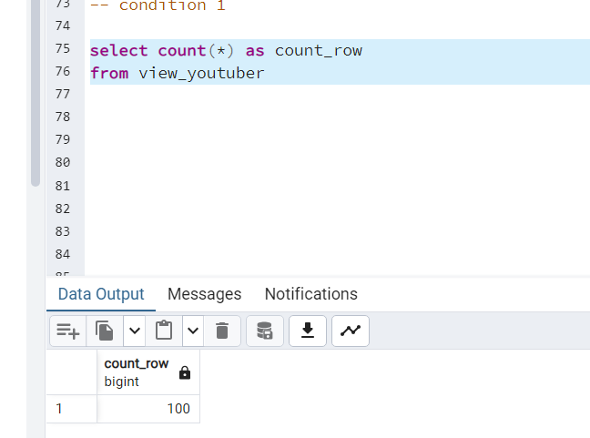
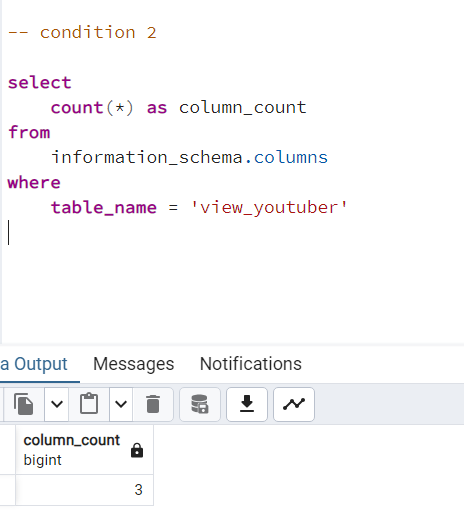
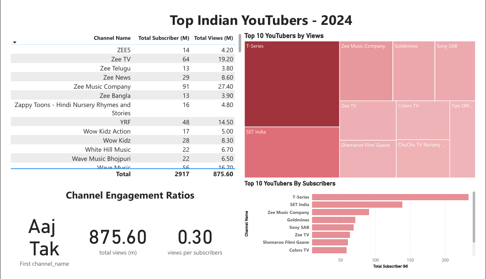

# Data Portfolio: Excel to Power BI

## Objective
###### To discover the top performing Indian Youtubers to form marketing collaborations with throughout the year 2024.

###### To create a dashboard that provides insights into the top UK YouTubers in 2024 that includes their
- subscriber count
- total views
- engagement metrics

###### This will help the marketing team make informed decisions about which YouTubers to collaborate with for their marketing campaigns.

## User story
- As the Head of Marketing, I want to use a dashboard that analyses YouTube channel data in the India.

- This dashboard should allow me to identify the top performing channels based on metrics like subscriber base and average views.

- With this information, I can make more informed decisions about which Youtubers are right to collaborate with, and therefore maximize how effective each marketing campaign is.

## Stages
- Design
- Developement
- Testing
- Analysis

## Design

### Dashboard components Required

- What should the dashboard contain based on the requirements provided?
To understand what it should contain, we need to figure out what questions we need the dashboard to answer:

1. Who are the top 10 YouTubers with the most subscribers?
2. Which 3 channels have the most views?
3. Which 3 channels have the highest average views per video?
4. Which 3 channels have the highest subscriber engagement rate per video uploaded?


## Tools

| Tool |	Purpose|
|------|---------|
|Excel |	Exploring the data|
|SQL Server|	Cleaning, testing, and analyzing the data|
|Power BI|	Visualizing the data via interactive dashboards|
|GitHub	| Hosting the project documentation and version control|

## Development
## Pseudocode
- What's the general approach in creating this solution from start to finish?
1. Get the data
2. Explore the data in Excel
3. Load the data into SQL Server
4. Clean the data with SQL
5. Test the data with SQL
6. Visualize the data in Power BI
7. Generate the findings based on the insights
8. Write the documentation + commentary
9. Publish the data to GitHub Pages
## Data exploration notes
This is the stage where you have a scan of what's in the data, errors, inconcsistencies, bugs, weird and corrupted characters etc

- What are your initial observations with this dataset? What's caught your attention so far?
1. There are at least 3 columns that contain the data we need for this analysis, which signals we have everything we need from the file without needing to contact the client for any more data.
2. The first column contains the channel ID with what appears to be channel IDS, which are separated by a @ symbol - we need to extract the channel names from this.
3. We have more data than we need, so some of these columns would need to be removed

## Data cleaning
What do we expect the clean data to look like? (What should it contain? What contraints should we apply to it?)

The aim is to refine our dataset to ensure it is structured and ready for analysis.

The cleaned data should meet the following criteria and constraints:

- Only relevant columns should be retained.
- All data types should be appropriate for the contents of each column.
- No column should contain null values, indicating complete data for all records.

Below is a table outlining the constraints on our cleaned dataset:

|Property|	Description|
|--------|-------------|
|Number of Rows|	100|
|Number of Columns |	3|

And here is a tabular representation of the expected schema for the clean data:

|Column Name	| Data Type	| Nullable |
|---------------|-----------|----------|
|channel_name	| VARCHAR |	NO |
|total_subscribers	| INTEGER |	NO |
|total_views	| INTEGER	| NO |

What steps are needed to clean and shape the data into the desired format?

1. Remove unnecessary columns by only selecting the ones you need
2. Extract Youtube channel names from the first column
3. Rename columns using aliases

## Transform the data

``` 
/*  STEP - 1

	Data Cleaning Steps

--> Remove unnecessery Columns by only selecting the one we need
--> Extract the youtube channel names from the first columns
--> Rename the column names

*/

--> condition - 1

SELECT
	NAME,
	FOLLOWERS,
	POTENTIAL_REACH
FROM 
	YOUTUBER
```
## Create the SQL view

```
/*
# 1. Create a view to store the transformed data
# 2. Cast the extracted channel name as VARCHAR(100)
# 3. Select the required columns from the youtuber SQL table 
*/

--> condition - 1

CREATE VIEW VIEW_YOUTUBERS AS

--> condition - 2

SELECT 
	CAST(SUBSTRING(NAME, 1, POSITION('@' IN NAME) -1) AS varchar(100)) as CHANNEL_NAME,
	 CAST(CAST(SUBSTRING (FOLLOWERS, 1, POSITION('M' IN FOLLOWERS) -1) AS FLOAT) AS INT) AS SUBSCRIBERS,
	 CAST(CAST(SUBSTRING (POTENTIAL_REACH, 1, POSITION('M' IN POTENTIAL_REACH) -1) AS FLOAT) AS INT) AS VIEWS

--> condition - 3     
FROM
	 YOUTUBER

```

## Testing

- What data quality and validation checks are you going to create?
Here are the data quality tests conducted:

## Row count check

```
/*
# Count the total number of records (or rows) are in the SQL view
*/

SELECT
    count(*) as count_row
FROM
    view_youtuber
```




## Column count check

``` 
/*
# Count the total number of columns (or fields) are in the SQL view
*/

select 
	count(*) as column_count
from
	information_schema.columns
where
	table_name = 'view_youtuber'

```


## Data type check

SQL Query
```
/*
# Check the data types of each column from the view by checking the INFORMATION SCHEMA view
*/

select 
	column_name,
	data_type
from
	information_schema.columns
where
	table_name = 'view_youtuber'

```


## Duplicate count check

SQL Query

```
/*
# 1. Check for duplicate rows in the view
# 2. Group by the channel name
# 3. Filter for groups with more than one row
*/


select 
    channel_name, 
    count(*) as duplicate_channel
from 
    view_youtuber
group by 
    channel_name
having 
    count(*) > 1

```


## Visualization

Result



## DAX Measures

1. Total Subscribers (M)

```
Total Subscribers (M) = 
VAR million = 1000000
VAR sumOfSubscribers = SUM(view_youtuber[total_subscribers])
VAR totalSubscribers = DIVIDE(sumOfSubscribers,million)

RETURN totalSubscribers
```

2. Total Views (M)

```
Total Views (M) = 
VAR billion = 1000000
VAR sumOfTotalViews = SUM(view_youtuber[total_views])
VAR totalViews = ROUND(sumOfTotalViews / million, 2)

RETURN totalViews
```
3. Subscriber Engagement Rate

```
Subscriber Engagement Rate = 
VAR sumOfTotalSubscribers = SUM(view_youtuber[total_subscribers])
VAR sumOfTotalVideos = SUM(view_youtuber[total_videos])
VAR subscriberEngRate = DIVIDE(sumOfTotalSubscribers, sumOfTotalVideos, BLANK())

RETURN subscriberEngRate 
```
4. Views per subscriber
 
 ```
Views Per Subscriber = 
VAR sumOfTotalViews = SUM(view_youtuber[total_views])
VAR sumOfTotalSubscribers = SUM(view_youtuber[total_subscribers])
VAR viewsPerSubscriber = DIVIDE(sumOfTotalViews, sumOfTotalSubscribers, BLANK())

RETURN viewsPerSubscriber 
```


-----

     |  Thank you  |
----
